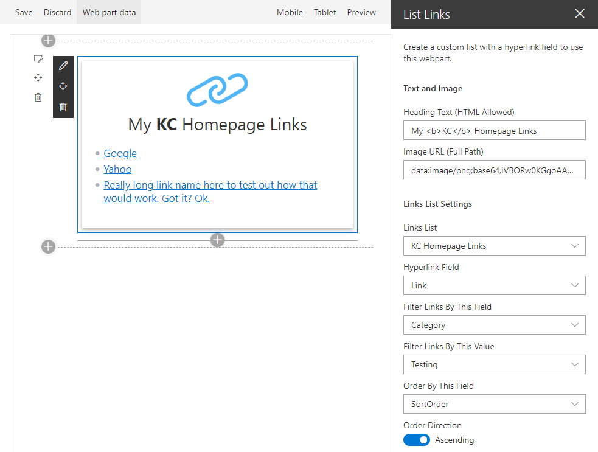

## sp-list-links-wp

A webpart to show links from a custom list. Optionally filter the links based on a text field.


### Building the code

```bash
git clone the repo
npm i
```

### Build options
#### To test in workbench:
```gulp serve --nobrowser```

##### To create production build:
```npm run ship```
